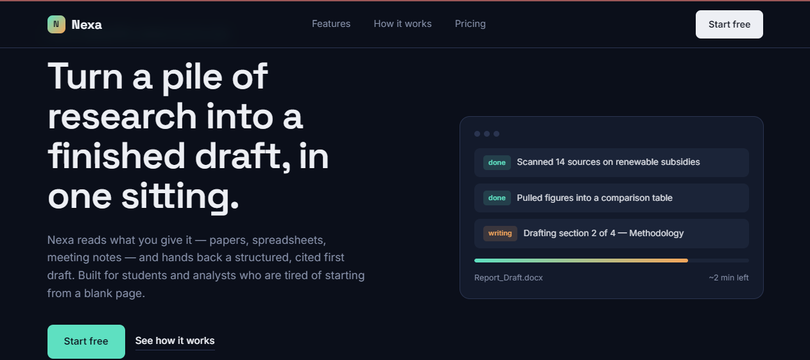

# Nexa — AI Research & Writing Landing Page

A modern, responsive landing page designed and developed for **Nexa**, a concept AI-powered tool that turns research documents into structured, cited drafts. Built as a portfolio project to demonstrate frontend design and development skills.

🔗 **[View Live Site](https://ashnagul079.github.io/Nexa_AI_Landing_Page/)**

---

## 📸 Preview

---

## 🚀 About the Project

Nexa is a fictional AI SaaS product concept — an assistant that reads uploaded research (PDFs, spreadsheets, notes) and generates a structured, source-cited draft. This project focuses purely on the **landing page design and frontend build**, showcasing how a real AI product would be presented and marketed to users.

---

## ✨ Features

- **Custom Visual Identity** — Dark, tech-inspired color palette with a signature teal-to-amber accent, built specifically for this product (no default templates used).
- **Animated Workflow Preview** — A live hero visual simulating Nexa processing documents in real time.
- **Asymmetric Feature Sections** — Each feature is paired with a relevant mini visual (chips, document cards, bar charts) instead of repeating identical cards.
- **Three-Step Process Section** — Clear "Upload → Review → Export" flow explaining how the product works.
- **Pricing Tiers** — Three-plan pricing layout (Student / Individual / Team) with a highlighted recommended plan.
- **Fully Responsive** — Optimized layout across desktop, tablet, and mobile screens.

---

## 🛠️ Tech Stack

- **HTML5** — Semantic structure
- **CSS3** — Custom properties, Grid & Flexbox layouts, animations
- **JavaScript** — Interactive progress animation

---

## 📁 Project Structure

Nexa_AI_Landing_Page/
├── index.html # Main page markup and structure
├── screenshot.png # Live preview image
└── README.md # Project documentation

---

## 👩‍💻 Author

**Ashna Gul**
BS Computer Science Student 
📧 ashnagul079@gmail.com
🔗 [GitHub](https://github.com/ashnagul079) | [LinkedIn](https://linkedin.com/in/ashna-gul-57a897376)
